# Umbrella Audio Transcriber - Architecture Diagrams

## System Architecture

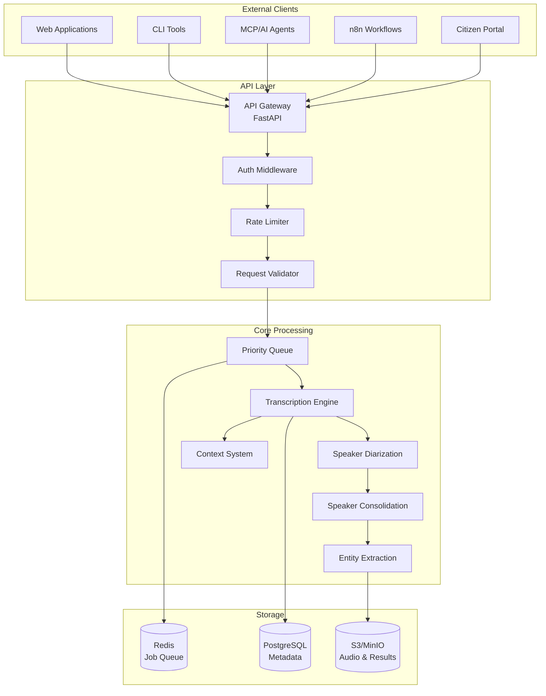

## Processing Pipeline

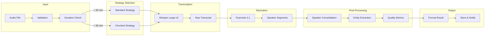

## Priority Queue Flow

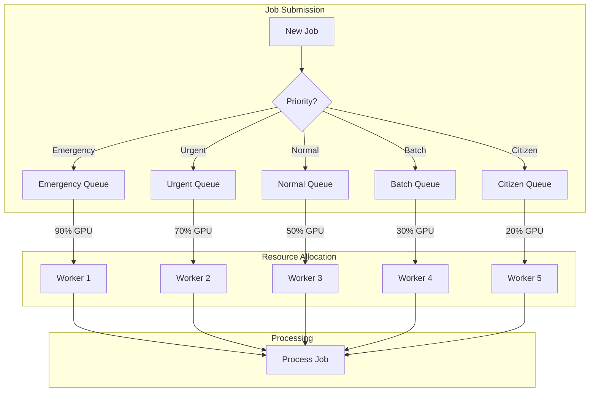

## Speaker Consolidation Algorithm

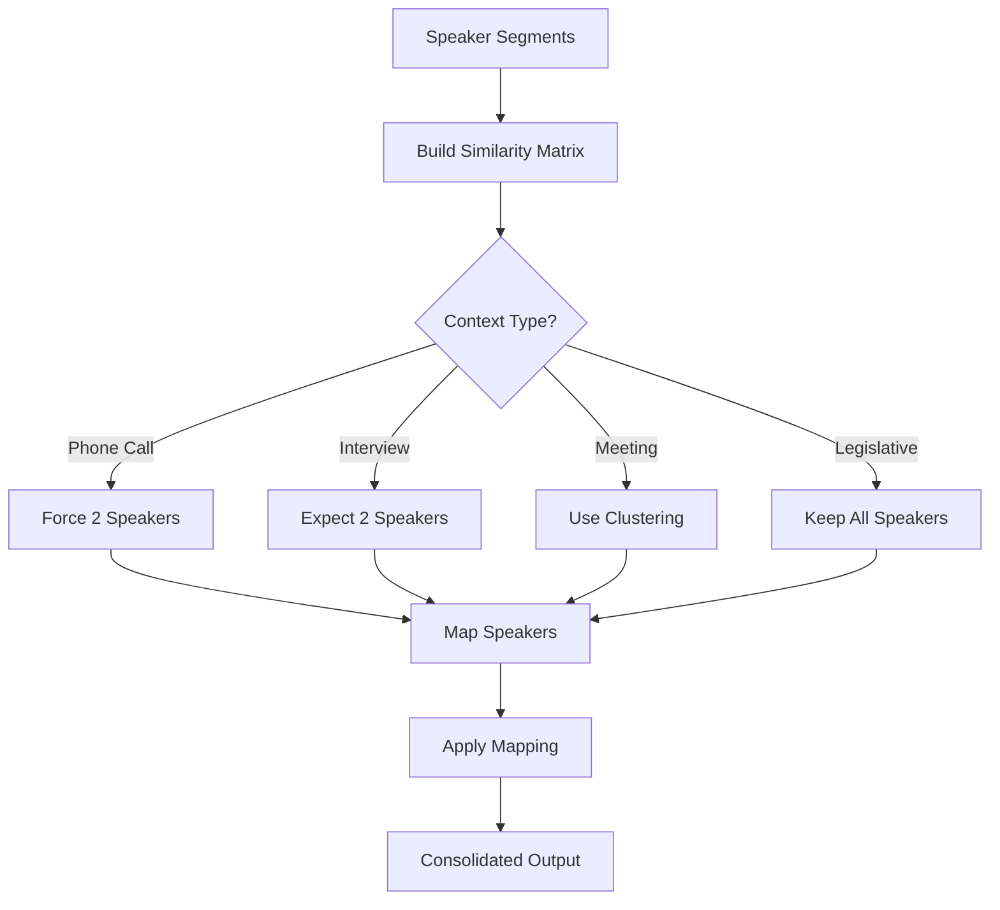

## API Request Flow

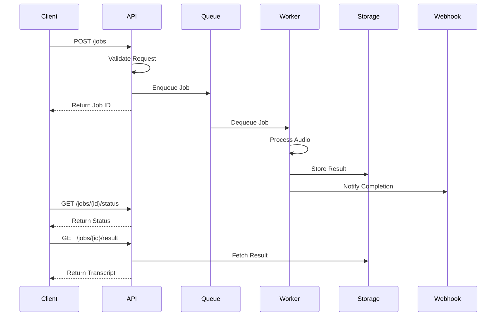

## Docker Container Architecture

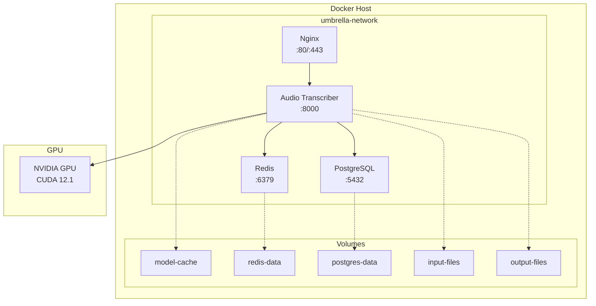

## MCP Integration Architecture

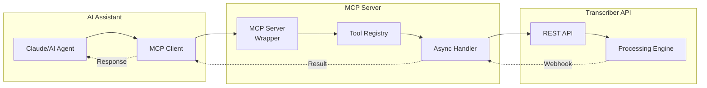

## Security Layers

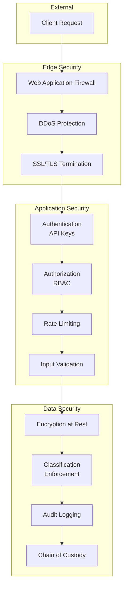

## Performance Optimization Flow

```mermaid
flowchart LR
    subgraph "Input Optimization"
        A1[Audio Input] --> A2[Format Detection]
        A2 --> A3[Resampling<br/>16kHz]
        A3 --> A4[Mono Conversion]
    end
    
    subgraph "GPU Optimization"
        B1[Model Loading] --> B2[Quantization<br/>INT8/FP16]
        B2 --> B3[Batch Processing]
        B3 --> B4[Memory Pool]
    end
    
    subgraph "Caching"
        C1[L1: Memory<br/>LRU Cache]
        C2[L2: Redis<br/>Distributed]
        C3[L3: Disk<br/>Persistent]
        C1 --> C2
        C2 --> C3
    end
    
    subgraph "Output"
        D1[Result Assembly] --> D2[Compression]
        D2 --> D3[Storage]
    end
    
    A4 --> B1
    B4 --> C1
    C3 --> D1
```

## Legislative Processing Specialization

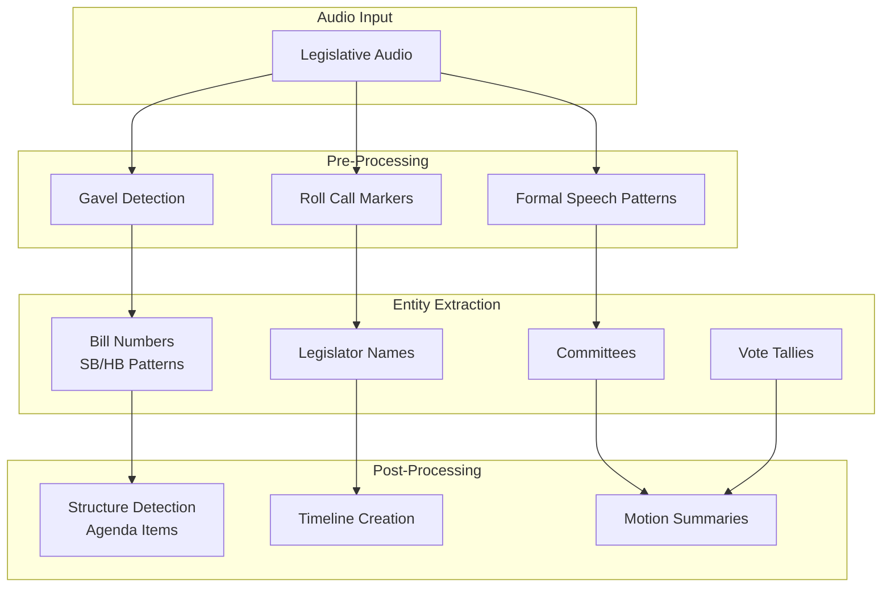

## Error Recovery Flow

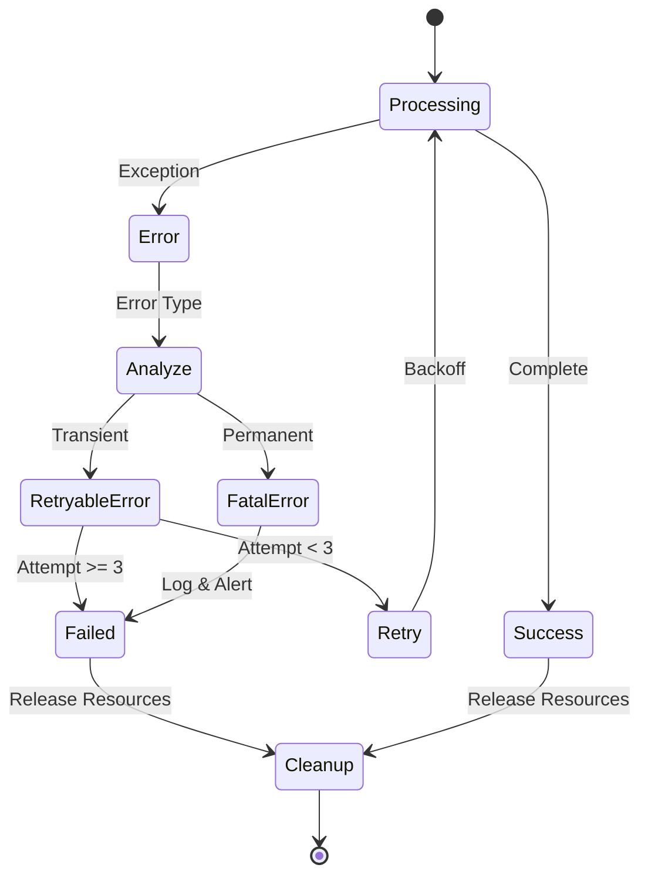

## Monitoring Dashboard Layout

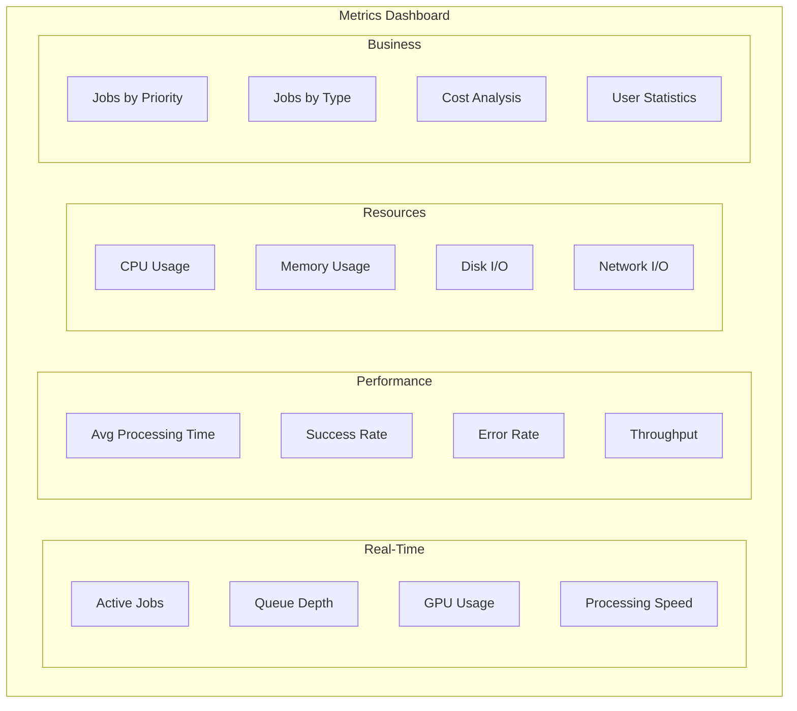

These diagrams provide a comprehensive visual representation of the Umbrella Audio Transcriber's architecture, workflows, and key components. They can be rendered using any Mermaid-compatible viewer or documentation system.